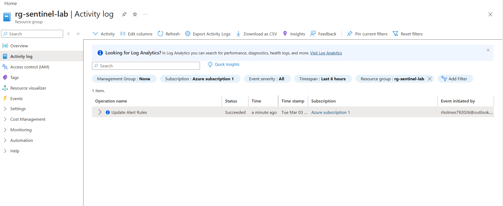
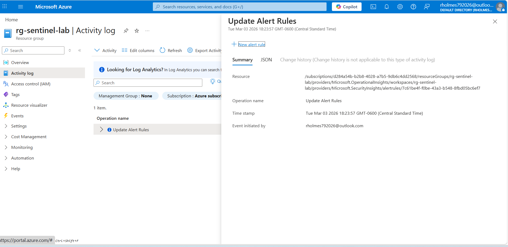

\# Microsoft Sentinel SIEM Lab (Azure Activity + KQL Detections)

\## Overview

This project demonstrates a hands-on Microsoft Sentinel SIEM lab: enabling Azure Activity log ingestion and building KQL-based analytics rules that generate incidents.

\## What I Built

\- Connected a Microsoft Sentinel workspace in the Microsoft Defender portal experience

\- Enabled Azure Activity log ingestion using the Azure Policy Assignment wizard (diagnostic settings pipeline)

\- Wrote and tuned KQL scheduled analytics rules

\- Triggered and validated incident creation in Sentinel

\## Key Skills Demonstrated

\- Microsoft Sentinel (SIEM) configuration

\- Azure Activity log ingestion

\- KQL (Kusto Query Language) detection engineering

\- Incident validation and basic triage workflow

\## Repository Layout

\- `kql/` — KQL queries used for validation and detection logic

\- `runbooks/` — step-by-step setup, rule creation, and validation notes

\- `evidence/` — screenshots proving ingestion, rule creation, and incident generation

\- `notes/` — short lessons learned / tuning notes

\## Detections

\- \*\*Validation\*\*: triggers on any Azure activity (used to prove the pipeline)

\- \*\*Real rule\*\*: detects repeated failed Azure operations within a short window

## Detection Scenario

This lab demonstrates detection of repeated Azure control-plane operation failures using Microsoft Sentinel.

### Threat Context
Repeated failed Azure control-plane actions may indicate:

- Privilege escalation attempts
- Unauthorized automation scripts
- Credential misuse
- Misconfigured service principals

### Detection Logic (KQL)

## Evidence

### Sentinel Incident Triggered

### Azure Activity Log Ingestion

\## Disclaimer

This repository contains no sensitive information. Screenshots may be redacted to remove tenant/subscription identifiers.

